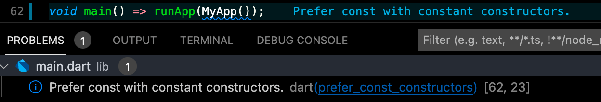
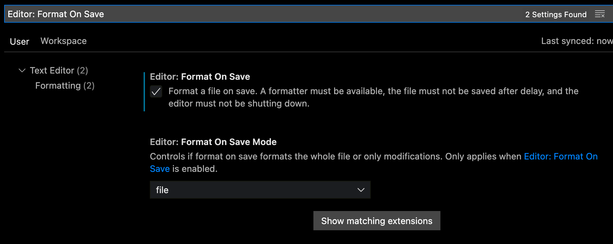

# 💅 Code style

It's good to keep consistent code style, at least project-wide, and Dart/Flutter does come with linting support.

## Linting

We're using `flutter_lints` package which contains recommended rules for Flutter apps.

Run linting by running `flutter analyze` command in the root of the project or integrate linter with your IDE.

## Formatting

To format the code use `flutter format lib/` or `flutter format test/` command in the root of a project.

### Usage with VS Code

Linting can be easily integrated via [Flutter](https://marketplace.visualstudio.com/items?itemName=Dart-Code.flutter) extension.

With this extension, you can find analysis issues in the **Problems** tab:
 

> To see issues next to affected line use [Error Lens](https://marketplace.visualstudio.com/items?itemName=usernamehw.errorlens) extension.

#### Auto-formatting on file save

Enable automatic code formatting on each file save by settings `Manage (Bottom left cog icon) ➡ Settings`, then search for _Editor: Format On Save_ and enable the checkbox:

